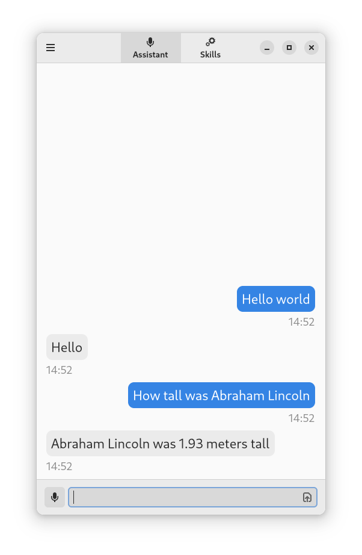

# Assistant <a href="https://hosted.weblate.org/engage/aspinwall-ui/"></a>

Voice assistant GUI based on Mycroft



## Installing

The project can be built and installed with Meson:

```shell
$ meson . build
$ meson compile -C build
$ sudo meson install -C build
```

For development purposes, the launcher can be started using the provided `./run` script, which will automatically launch the GTK4 debugger.

Before you can use the `./run` script, you will need to install Meson.

## Requirements

### Runtime

- Python >= 3.6
- PyGObject
- GTK4
- libadwaita
- requests
- [mycroft-core](https://github.com/MycroftAI/mycroft-core)
- [mycroft_bus_client](https://github.com/MycroftAI/mycroft-messagebus-client)

### Build

These are also needed if you're planning to use the provided run scripts.

- meson
- glib2-dev or equivalent (needed for `glib-compile-schemas`)
- desktop-file-utils (needed for `update-desktop-database`)


## Contributing

See [Aspinwall's contributing guide](https://github.com/aspinwall-ui/aspinwall/blob/develop/docs/contributing/contributing.md).

We also use Weblate for translations. [Weblate project](https://hosted.weblate.org/projects/aspinwall-ui/lapel)
